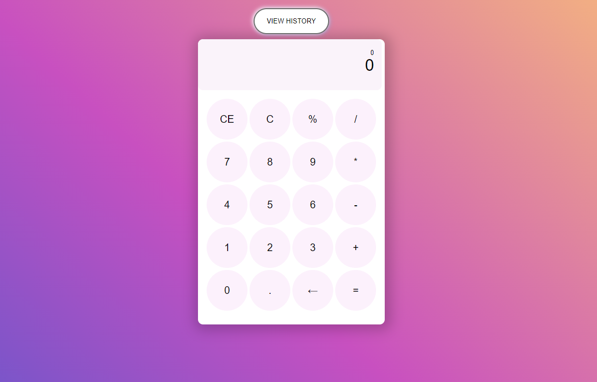

# Calculadora - Thomas Barreto
#### Proyecto propuesto por Daira It Group

## Vista previa:

## 📄 Instrucciones para iniciar la app

**Primero debemos:** Clonar el repositorio o descargar el proyecto luego correr el cliente:

**Cliente:** Entrar a la carpeta client e instalar dependencias con npm install e iniciarla con el comando npm run dev


```bash
 Una vez esta iniciado el cliente podra usar la app correctamente
```

## 🏗 Tecnologias utilizadas

- Svelte

## Autor ✒️

 **Thomas Barreto** - [1thomas13](https://github.com/1thomas13)
